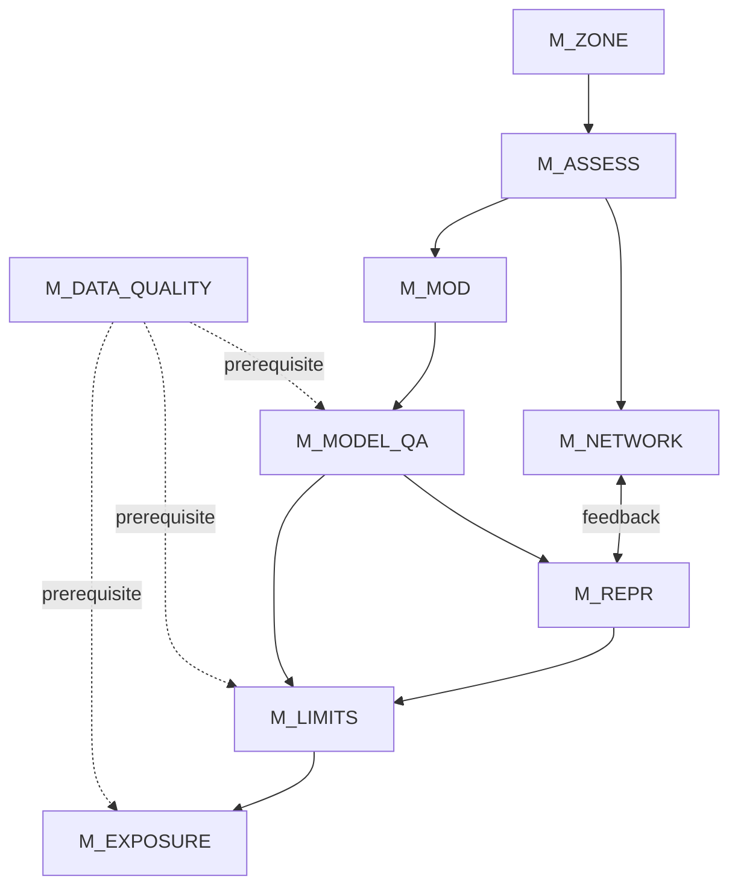

# Architettura del framework

## Panoramica

Il framework è basato su una pipeline logica che rappresenta il processo di valutazione della qualità dell’aria secondo la Direttiva (UE) 2024/2881.

---

## Pipeline


Il diagramma seguente rappresenta le dipendenze logiche tra i moduli del framework.



---

## Descrizione dei moduli

### M_ZONE — Suddivisione territoriale
Definisce la suddivisione del territorio in zone e agglomerati.

---

### M_ASSESS — Regime di valutazione
Determina il regime di valutazione in base alle soglie.

---

### M_NETWORK — Rete di monitoraggio
Verifica l’adeguatezza della rete di monitoraggio.

---

### M_MOD — Applicazioni modellistiche
Gestisce le applicazioni modellistiche.

---

### M_MODEL_QA — Garanzia qualità modelli
Valida le prestazioni del modello.

---

### M_REPR — Rappresentatività spaziale
Definisce le aree di rappresentatività dei punti di misura.

---

### M_LIMITS — Conformità ai valori limite
Verifica la conformità ai valori limite.

---

### M_EXPOSURE — Indicatore di esposizione media
Calcola l’indicatore di esposizione (AEI).

---

## Flusso logico

1. Il territorio è suddiviso in zone (M_ZONE)  
2. Viene determinato il regime di valutazione (M_ASSESS)  
3. Si verifica l’adeguatezza della rete (M_NETWORK)  
4. Si applica la modellistica (M_MOD)  
5. Il modello viene validato (M_MODEL_QA)  
6. Si determinano le aree di rappresentatività (M_REPR)  
7. Si valutano i superamenti (M_LIMITS)  
8. Si calcola l’esposizione (M_EXPOSURE)  

---

## Integrazione tra moduli

### Modellistica e rete

- il modello integra le misure
- identifica lacune nella rete

---

### Rappresentatività e conformità

- determina dove una misura è valida
- influenza il calcolo della conformità

---

### Validazione e utilizzo

- il modello è utilizzabile solo se validato (M_MODEL_QA)

---

## Separazione logica e dati

Il framework distingue:

### Logica (moduli)
- condizioni
- relazioni
- flussi decisionali

### Dati (tabelle)
- valori limite
- soglie
- parametri tecnici

---

## Output del sistema

Il risultato finale è:

```

compliance status per zone e inquinante

```

---

## Caratteristiche dell'architettura

- modulare
- estendibile
- formalizzabile
- compatibile con automazione
- integrabile con LLM

---

## Note

Il framework è progettato per essere:

- implementato in sistemi software
- utilizzato per supporto decisionale
- verificabile in modo trasparente
