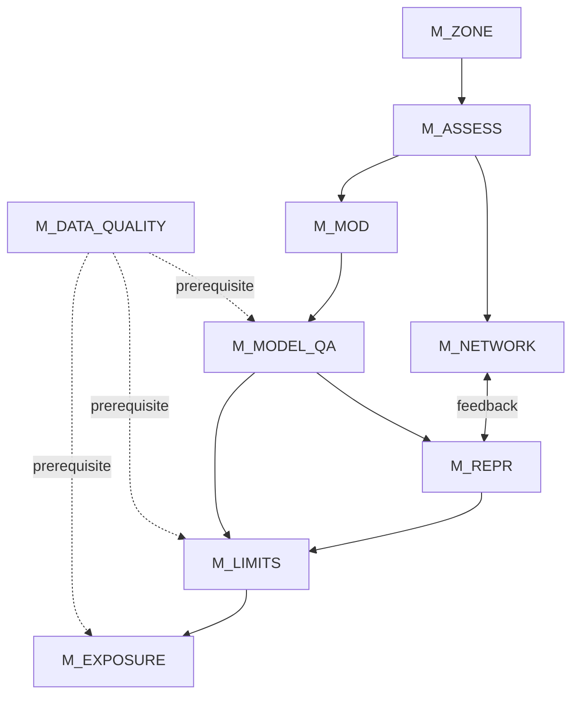

# Framework architecture

## Overview

The framework is based on a logical pipeline that represents the air quality assessment process under Directive (EU) 2024/2881.

---

## Pipeline

The following diagram shows the logical dependencies between framework modules.
Solid arrows indicate direct dependencies; dashed arrows indicate cross-cutting prerequisites; the bidirectional arrow indicates a feedback loop.



---

## Module descriptions

### M_ZONE — Territorial subdivision
Defines the subdivision of territory into zones and agglomerations.

---

### M_ASSESS — Assessment regime
Determines the assessment regime based on thresholds.

---

### M_NETWORK — Monitoring network
Checks the adequacy of the monitoring network.

---

### M_MOD — Modelling applications
Manages modelling applications.

---

### M_MODEL_QA — Model quality assurance
Validates model performance.

---

### M_REPR — Spatial representativeness
Defines the representativeness areas of measurement points.

---

### M_LIMITS — Compliance with limit values
Checks compliance with limit values.

---

### M_EXPOSURE — Average exposure indicator
Computes the exposure indicator (AEI).

---

## Module integration

### Modelling and network

- the model integrates measurements
- it identifies gaps in the network

---

### Representativeness and compliance

- determines where a measurement is valid
- influences compliance calculation

---

### Validation and use

- the model is usable only if validated (`M_MODEL_QA`)

---

## Logical/data separation

The framework distinguishes:

### Logic (modules)
- conditions
- relationships
- decision flows

### Data (tables)
- limit values
- thresholds
- technical parameters

---

## System output

The final result is:

```
compliance status by zone and pollutant
```

---

## Architecture characteristics

- modular
- extensible
- formalizable
- automation-friendly
- integrable with LLMs

---

## Notes

The framework is designed to be:

- implemented in software systems
- used for decision support
- verifiable in a transparent way
