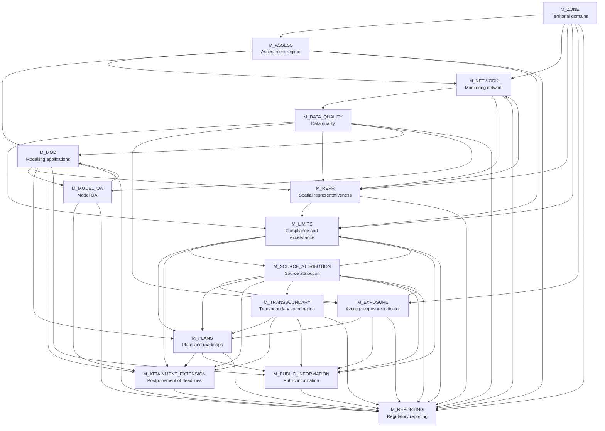

# Framework architecture

## Overview

The framework is a **formal and computable architecture** for implementing Directive (EU) 2024/2881 on ambient air quality.

It models the Directive as a set of interoperable modules (`M_*`) and normative parameter tables (`T_*`). Each module has a limited responsibility and exchanges structured outputs with the others.

The architecture is a **layered regulatory decision system**, not a simple linear pipeline.

The main layers are:

1. territorial context;
2. assessment regime;
3. monitoring and data validity;
4. modelling and spatial representativeness;
5. compliance and exposure assessment;
6. source attribution;
7. planning and postponement decisions;
8. transboundary coordination;
9. public information and reporting.

---

## Architectural principles

### Separation of concerns

Each module performs one regulatory function only.

Examples:

- `M_LIMITS` determines compliance and exceedance status.
- `M_SOURCE_ATTRIBUTION` determines source-attribution evidence.
- `M_PLANS` determines planning obligations.
- `M_REPORTING` reports outputs but does not recalculate them.

### Legal-effect boundaries

Several modules produce evidence or candidate legal effects, but do not decide final institutional consequences.

Examples:

- `M_SOURCE_ATTRIBUTION` may identify a natural-source case, but `M_LIMITS` determines whether an exceedance is omitted for Directive purposes.
- `M_ATTAINMENT_EXTENSION` evaluates whether a deadline extension is supported, but does not grant it.
- `M_TRANSBOUNDARY` coordinates cross-border cases, but does not assign legal responsibility between Member States.

### Purpose-specific validation

Validity is purpose-specific.

Examples:

- data valid for reporting may not be sufficient for network reduction;
- a model valid for annual assessment may not be valid for short-term forecasts;
- a representativeness area valid for one pollutant or metric is not automatically valid for another.

### Traceability and versioning

All regulatory outputs should be traceable to:

- territorial version;
- data version;
- model version;
- method and validation status;
- assessment period;
- legal source;
- reporting package.

---

## Layered architecture



---

## Functional layers

### Layer 1 — Territorial context

`M_ZONE` defines zones, agglomerations, average exposure territorial units, plan areas, transboundary affected areas and territorial versions.

### Layer 2 — Assessment regime and monitoring

`M_ASSESS` determines the assessment regime and method requirements.

`M_NETWORK` determines monitoring-network adequacy, additional measurements, relocation constraints and supersite obligations.

`M_DATA_QUALITY` determines whether datasets are valid for specific regulatory purposes.

### Layer 3 — Modelling and spatial representativeness

`M_MOD` manages modelling uses: assessment, spatial distribution, hotspots, forecasts, projections, transboundary contribution and source-attribution support.

`M_MODEL_QA` determines whether a model is valid for a specific purpose.

`M_REPR` determines spatial representativeness areas and whether fixed measurements cover modelled exceedance areas.

### Layer 4 — Regulatory assessment

`M_LIMITS` determines compliance and exceedance status.

`M_EXPOSURE` determines AEI values and exposure-obligation status.

### Layer 5 — Explanation and legal qualification

`M_SOURCE_ATTRIBUTION` determines evidence for natural sources, winter sanding/salting, transboundary contribution and source profiles for plans.

### Layer 6 — Planning and deadline extension

`M_PLANS` determines planning obligations for air quality plans, roadmaps and short-term action plans.

`M_ATTAINMENT_EXTENSION` evaluates whether postponement of attainment deadlines is supported.

### Layer 7 — Coordination and external outputs

`M_TRANSBOUNDARY` coordinates transboundary cases.

`M_PUBLIC_INFORMATION` transforms validated outputs into public-facing information.

`M_REPORTING` aggregates module outputs into official reporting packages.

---

## Core feedback loops

### Monitoring–representativeness loop


### Modelling–representativeness–limits loop


### Compliance–source–planning loop


### Planning–extension loop


---

## Data and table layer

The framework separates **logic** from **normative parameter data**.

### Logic modules (`M_*`)

Modules define:

- conditions;
- dependencies;
- decision flows;
- outputs;
- legal-effect boundaries.

### Existing tables

The following `T_*` table files currently exist in the repository and may be linked from navigation documents:

- `T_ADVANCED_MONITORING` — Advanced monitoring obligations
- `T_ALERT_THRESHOLDS` — Alert and information thresholds
- `T_ASSESS_THRESHOLDS` — Assessment thresholds
- `T_DATA_QUALITY` — Data quality objectives
- `T_EIONET` — EIONET vocabularies and interoperability standards
- `T_EXPOSURE_OBLIGATIONS` — Exposure reduction obligations and objectives
- `T_LIMIT_VALUES` — Limit values and target values
- `T_MIN_STATIONS` — Minimum number of sampling points
- `T_NATURAL_EVENTS` — Natural events and natural-source criteria
- `T_REPR_TOLERANCE` — Spatial representativeness tolerances
- `T_SITING` — Siting criteria
- `T_SUPERSITES` — Supersite parameters

### Planned tables — not yet implemented

The following tables are referenced conceptually by the architecture or by module dependencies, but the corresponding files do not yet exist. They should not be linked from navigation documents until created:

- `T_MODEL_QA` — Model quality assurance parameters
- `T_SOURCE_CATEGORIES` — Source categories
- `T_ATTRIBUTION_METHODS` — Source-attribution methods
- `T_NUTS` — NUTS territorial references
- `T_REPORTING_SCHEMA` — Reporting schemas

### Table-linking rule

Documentation pages should link only to existing table files. Planned tables may be mentioned as planned dependencies, but without Markdown links.

---

## Main system outputs

The framework produces multiple regulatory outputs:

```text
territorial_context
assessment_status
network_status
data_quality_status
model_validation
representativeness_status
model_output
compliance_result
exposure_status
source_attribution_status
plan_status
attainment_extension
transboundary_status
public_information
reporting_package
```

---

## System boundaries

The framework supports decision-making but does not replace institutional acts.

It does not:

- designate competent authorities;
- grant postponements;
- impose penalties;
- assign legal responsibility between Member States;
- substitute formal Commission assessment;
- replace public participation procedures.

---

## Architecture characteristics

The architecture is:

- modular;
- extensible;
- auditable;
- automation-friendly;
- compatible with rule engines;
- compatible with LLM-assisted workflows;
- interoperable with reporting and data-exchange systems;
- suitable for progressive implementation.

---

## Implementation notes

Recommended implementation sequence:

1. implement `M_ZONE`, `M_DATA_QUALITY`, and existing `T_*` base tables;
2. implement `M_ASSESS`, `M_NETWORK`, `M_REPR`;
3. implement `M_MOD` and `M_MODEL_QA`;
4. implement `M_LIMITS` and `M_EXPOSURE`;
5. implement `M_SOURCE_ATTRIBUTION`;
6. implement `M_PLANS` and `M_ATTAINMENT_EXTENSION`;
7. implement `M_TRANSBOUNDARY`, `M_PUBLIC_INFORMATION`, `M_REPORTING`;
8. create planned tables only when their schema is stabilised.

---

## Notes

This architecture reflects the completed module set of the framework and replaces the earlier linear pipeline view.

The key design shift is that the Directive is represented as a **multi-layer regulatory system**, where assessment, evidence, compliance, planning, coordination and reporting remain distinct but interoperable.
