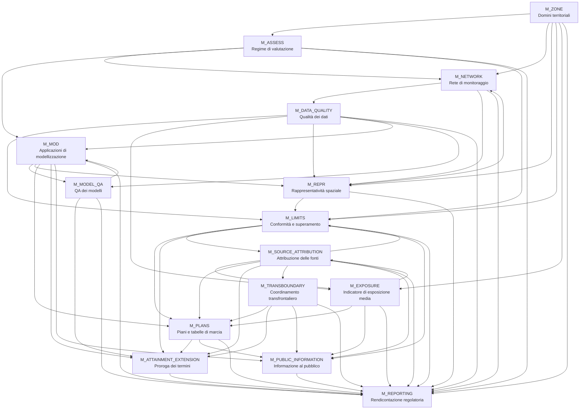
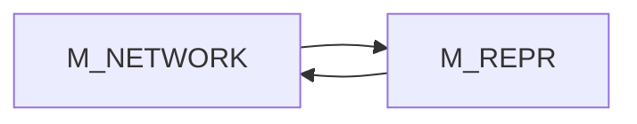
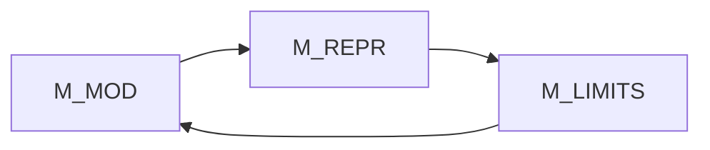
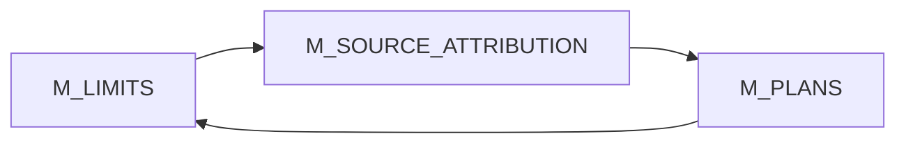
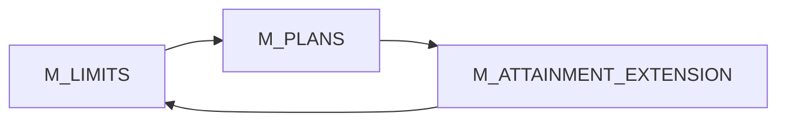

# Architettura del framework

## Panoramica

Il framework è una **architettura formale e computabile** per implementare la Direttiva (UE) 2024/2881 sulla qualità dell’aria ambiente.

Modella la Direttiva come un insieme di moduli interoperabili (`M_*`) e tabelle di parametri normativi (`T_*`).

Ogni modulo ha una responsabilità limitata e scambia output strutturati con gli altri.

L’architettura è un **sistema decisionale regolatorio a livelli**, non una semplice pipeline lineare.

I livelli principali sono:

1. contesto territoriale;
2. regime di valutazione;
3. monitoraggio e validità dei dati;
4. modellizzazione e rappresentatività spaziale;
5. valutazione di conformità ed esposizione;
6. attribuzione delle fonti;
7. decisioni di pianificazione e proroga;
8. coordinamento transfrontaliero;
9. informazione al pubblico e rendicontazione.

---

## Principi architetturali

### Separazione delle responsabilità

Ogni modulo svolge una sola funzione regolatoria.

Esempi:

- `M_LIMITS` determina lo stato di conformità e di superamento.
- `M_SOURCE_ATTRIBUTION` determina le evidenze di attribuzione delle fonti.
- `M_PLANS` determina gli obblighi di pianificazione.
- `M_REPORTING` rendiconta gli output ma non li ricalcola.

### Confini degli effetti giuridici

Diversi moduli producono evidenze o effetti giuridici candidati, ma non decidono le conseguenze istituzionali finali.

Esempi:

- `M_SOURCE_ATTRIBUTION` può identificare un caso di fonte naturale, ma `M_LIMITS` determina se un superamento è omesso ai fini della Direttiva.
- `M_ATTAINMENT_EXTENSION` valuta se una proroga del termine è supportata, ma non la concede.
- `M_TRANSBOUNDARY` coordina i casi transfrontalieri, ma non assegna responsabilità giuridica tra Stati membri.

### Validazione specifica per scopo

La validità è specifica per lo scopo.

Esempi:

- dati validi per la rendicontazione possono non essere sufficienti per la riduzione della rete;
- un modello valido per la valutazione annuale può non essere valido per previsioni a breve termine;
- un’area di rappresentatività valida per un inquinante o una metrica non è automaticamente valida per un altro.

### Tracciabilità e versioning

Tutti gli output regolatori dovrebbero essere tracciabili rispetto a:

- versione territoriale;
- versione dei dati;
- versione del modello;
- metodo e stato di validazione;
- periodo di valutazione;
- fonte giuridica;
- pacchetto di rendicontazione.

---

## Architettura a livelli



---

## Livelli funzionali

### Livello 1 — Contesto territoriale

`M_ZONE` definisce zone, agglomerati, unità territoriali di esposizione media, aree di piano, aree interessate transfrontaliere e versioni territoriali.

### Livello 2 — Regime di valutazione e monitoraggio

`M_ASSESS` determina il regime di valutazione e i requisiti del metodo.

`M_NETWORK` determina l’adeguatezza della rete di monitoraggio, le misurazioni aggiuntive, i vincoli di rilocalizzazione e gli obblighi relativi ai supersiti.

`M_DATA_QUALITY` determina se i dataset sono validi per specifici scopi regolatori.

### Livello 3 — Modellizzazione e rappresentatività spaziale

`M_MOD` gestisce gli usi della modellizzazione: valutazione, distribuzione spaziale, punti critici di inquinamento atmosferico, previsioni, proiezioni, contributo transfrontaliero e supporto all’attribuzione delle fonti.

`M_MODEL_QA` determina se un modello è valido per uno scopo specifico.

`M_REPR` determina le aree di rappresentatività spaziale e se le misurazioni in siti fissi coprono le aree modellate di superamento.

### Livello 4 — Valutazione regolatoria

`M_LIMITS` determina lo stato di conformità e di superamento.

`M_EXPOSURE` determina i valori dell’IEM e lo stato degli obblighi di esposizione.

### Livello 5 — Spiegazione e qualificazione giuridica

`M_SOURCE_ATTRIBUTION` determina le evidenze per fonti naturali, sabbiatura/salatura invernale, contributo transfrontaliero e profili di fonte per i piani.

### Livello 6 — Pianificazione e proroga dei termini

`M_PLANS` determina gli obblighi di pianificazione per piani per la qualità dell’aria, tabelle di marcia e piani d’azione a breve termine.

`M_ATTAINMENT_EXTENSION` valuta se la proroga dei termini di conseguimento è supportata.

### Livello 7 — Coordinamento e output esterni

`M_TRANSBOUNDARY` coordina i casi transfrontalieri.

`M_PUBLIC_INFORMATION` trasforma output validati in informazione destinata al pubblico.

`M_REPORTING` aggrega gli output dei moduli in pacchetti ufficiali di rendicontazione.

---

## Loop di feedback principali

### Loop monitoraggio–rappresentatività



### Loop modellizzazione–rappresentatività–limiti



### Loop conformità–fonti–pianificazione



### Loop pianificazione–proroga



---

## Livello dati e tabelle

Il framework separa la **logica** dai **dati dei parametri normativi**.

### Moduli logici (`M_*`)

I moduli definiscono:

- condizioni;
- dipendenze;
- flussi decisionali;
- output;
- confini degli effetti giuridici.

### Tabelle esistenti

I seguenti file di tabella `T_*` esistono attualmente nel repository e possono essere collegati dai documenti di navigazione:

- `T_ADVANCED_MONITORING` — Obblighi di monitoraggio avanzato
- `T_ALERT_THRESHOLDS` — Soglie di allarme e informazione
- `T_ASSESS_THRESHOLDS` — Soglie di valutazione
- `T_DATA_QUALITY` — Obiettivi di qualità dei dati
- `T_EIONET` — Vocabolari EIONET e standard di interoperabilità
- `T_EXPOSURE_OBLIGATIONS` — Obblighi e obiettivi di riduzione dell’esposizione
- `T_LIMIT_VALUES` — Valori limite e valori-obiettivo
- `T_MIN_STATIONS` — Numero minimo di punti di campionamento
- `T_NATURAL_EVENTS` — Eventi naturali e criteri per fonti naturali
- `T_REPR_TOLERANCE` — Tolleranze di rappresentatività spaziale
- `T_SITING` — Criteri di ubicazione
- `T_SUPERSITES` — Parametri dei supersiti

### Tabelle pianificate — non ancora implementate

Le seguenti tabelle sono richiamate concettualmente dall’architettura o dalle dipendenze dei moduli, ma i file corrispondenti non esistono ancora. Non dovrebbero essere collegate dai documenti di navigazione finché non saranno create:

- `T_MODEL_QA` — Parametri di assicurazione della qualità dei modelli
- `T_SOURCE_CATEGORIES` — Categorie di fonti
- `T_ATTRIBUTION_METHODS` — Metodi di attribuzione delle fonti
- `T_NUTS` — Riferimenti territoriali NUTS
- `T_REPORTING_SCHEMA` — Schemi di rendicontazione

### Regola sui collegamenti alle tabelle

Le pagine di documentazione dovrebbero collegare solo file di tabella esistenti.

Le tabelle pianificate possono essere menzionate come dipendenze pianificate, ma senza link Markdown.

---

## Output principali del sistema

Il framework produce molteplici output regolatori:

```text
territorial_context
assessment_status
network_status
data_quality_status
model_validation
representativeness_status
model_output
compliance_result
exposure_status
source_attribution_status
plan_status
attainment_extension
transboundary_status
public_information
reporting_package
```

---

## Confini del sistema

Il framework supporta il processo decisionale ma non sostituisce gli atti istituzionali.

Non svolge le seguenti funzioni:

- designare le autorità competenti;
- concedere proroghe;
- imporre sanzioni;
- assegnare responsabilità giuridica tra Stati membri;
- sostituire la valutazione formale della Commissione;
- sostituire le procedure di partecipazione del pubblico.

---

## Caratteristiche dell’architettura

L’architettura è:

- modulare;
- estensibile;
- auditabile;
- adatta all’automazione;
- compatibile con rule engine;
- compatibile con workflow assistiti da LLM;
- interoperabile con sistemi di rendicontazione e scambio dati;
- adatta a un’implementazione progressiva.

---

## Note di implementazione

Sequenza di implementazione raccomandata:

1. implementare `M_ZONE`, `M_DATA_QUALITY` e le tabelle di base `T_*` esistenti;
2. implementare `M_ASSESS`, `M_NETWORK`, `M_REPR`;
3. implementare `M_MOD` e `M_MODEL_QA`;
4. implementare `M_LIMITS` e `M_EXPOSURE`;
5. implementare `M_SOURCE_ATTRIBUTION`;
6. implementare `M_PLANS` e `M_ATTAINMENT_EXTENSION`;
7. implementare `M_TRANSBOUNDARY`, `M_PUBLIC_INFORMATION`, `M_REPORTING`;
8. creare le tabelle pianificate solo quando il loro schema sarà stabilizzato.

---

## Note

Questa architettura riflette l’insieme completo dei moduli del framework e sostituisce la precedente vista come pipeline lineare.

Il cambiamento progettuale chiave è che la Direttiva è rappresentata come un **sistema regolatorio multilivello**, in cui valutazione, evidenze, conformità, pianificazione, coordinamento e rendicontazione restano distinti ma interoperabili.
